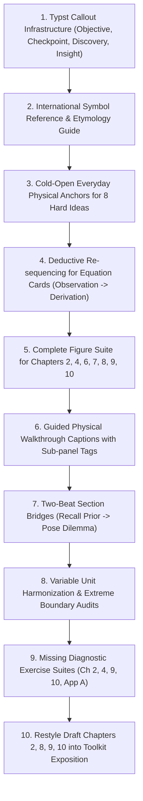

Viewed math_tools_en.md:1-150
Ran command: `Get-Content -Path "C:\Users\NGOC\Documents\vatly_11\book\math_tools_en.md" -TotalCount 100`
Ran command: `Get-Content -Path "C:\Users\NGOC\Documents\vatly_11\book\math_tools_en.md" | Select-String -Pattern "^## " -Context 0,2`
Ran command: `powershell -Command "(Get-Content 'C:\Users\NGOC\Documents\vatly_11\book\math_tools_en.md' -Raw).Length"`
Ran command: `powershell -Command "Get-Content 'C:\Users\NGOC\Documents\vatly_11\book\math_tools_en.md' | Select-Object -Skip 100 -First 150"`
Ran command: `powershell -Command "Get-Content 'C:\Users\NGOC\Documents\vatly_11\book\math_tools_en.md' | Select-Object -Skip 250 -First 150"`
Ran command: `powershell -Command "(Get-Content 'C:\Users\NGOC\Documents\vatly_11\book\math_tools_en.md').Count"`
Ran command: `powershell -Command "Get-Content 'C:\Users\NGOC\Documents\vatly_11\book\math_tools_en.md' | Select-Object -Skip 120 -First 60"`
Ran command: `powershell -Command "Get-Content 'C:\Users\NGOC\Documents\vatly_11\book\math_tools_en.typ' -Head 50"`
Ran command: `powershell -Command "Get-Content 'C:\Users\NGOC\Documents\vatly_11\book\math_tools_en.typ' | Select-String -Pattern '#let|#show|==|===|box\(' -Context 0,1"`
Viewed pedagogy_harness.md:1-100
Viewed pedagogy_harness.md:98-108
Viewed BOOK_PEDAGOGY.md:1-150
Viewed BOOK_PEDAGOGY.md:151-187
Viewed BOOK_STATUS.md:1-57
Ran command: `dir book-en`
Ran command: `powershell -Command "Test-Path 'dist/voice-edge-fpga-book-print.pdf'"`
Ran command: `python -c "import pypdf; reader = pypdf.PdfReader('dist/voice-edge-fpga-book-print.pdf'); print(f'Pages: {len(reader.pages)}')"`
Ran command: `python -c "import fitz; doc = fitz.open('dist/voice-edge-fpga-book-print.pdf'); print(f'Pages: {len(doc)}')"`
Ran command: `python -c "import pymupdf; doc = pymupdf.open('C:/Users/NGOC/Documents/vatly_11/dist/math_tools_en.pdf'); print('Pages:', len(doc)); [print(f'Page {i+1}: {len(p.get_text())} chars') for i, p in enumerate(doc)]"`
Ran command: `python -c "import pymupdf; doc = pymupdf.open('C:/Users/NGOC/Documents/vatly_11/dist/math_tools_en.pdf'); print(doc[0].get_text()[:1000]); print('--- PAGE 2 ---'); print(doc[1].get_text()[:1000])"`
Ran command: `python -c "import sys, pymupdf; sys.stdout.reconfigure(encoding='utf-8'); doc = pymupdf.open('C:/Users/NGOC/Documents/vatly_11/dist/math_tools_en.pdf'); print(doc[0].get_text()[:800]); print('--- PAGE 2 ---'); print(doc[1].get_text()[:800])"`
Ran command: `python -c "import sys, pymupdf; sys.stdout.reconfigure(encoding='utf-8'); doc = pymupdf.open('C:/Users/NGOC/Documents/vatly_11/dist/math_tools_en.pdf'); [print(f'=== PAGE {i+1} ===\n', doc[i].get_text()) for i in range(2, 6)]"`
Ran command: `python -c "
import os, glob

files = sorted(glob.glob('book-en/*.md'))
for f in files:
    with open(f, 'r', encoding='utf-8') as fp:
        lines = fp.readlines()
    headings = [l.strip() for l in lines if l.startswith('#')]
    eq_cards = [i for i, l in enumerate(lines) if '**The formula.**' in l or '**The variables.**' in l]
    figures = [l.strip() for l in lines if 'fig-' in l or 'Figure ' in l or '::: {#fig' in l]
    print(f'=== {f} ({len(lines)} lines) ===')
    print(f'  Headings ({len(headings)}): {headings[:6]}...')
    print(f'  Equation card hits: {len(eq_cards)}')
    print(f'  Figure mentions/defs: {len(figures)}')
"`
Ran command: `python -c "
with open('book-en/chapter08.md', 'r', encoding='utf-8') as f:
    print(''.join(f.readlines()[:40]))
print('--- CH 09 ---')
with open('book-en/chapter09.md', 'r', encoding='utf-8') as f:
    print(''.join(f.readlines()[:40]))
"`
Ran command: `python -c "
import sys, pymupdf
sys.stdout.reconfigure(encoding='utf-8')
doc = pymupdf.open('dist/voice-edge-fpga-book-print.pdf')
toc = doc.get_toc()
print(f'TOC entries: {len(toc)}')
for item in toc[:35]:
    print(item)
"`
Ran command: `python -c "
import sys, pymupdf
sys.stdout.reconfigure(encoding='utf-8')
doc = pymupdf.open('dist/voice-edge-fpga-book-print.pdf')
toc = doc.get_toc()
for item in toc[35:80]:
    print(item)
print('--- REMAINING ---')
for item in toc[80:]:
    print(item)
"`
Ran command: `git status`
Ran command: `python -c "
with open('book-en/chapter01.md', 'r', encoding='utf-8') as f:
    text = f.read()

# Look at 1.2, 1.3, 1.4 openings
import re
print('=== CH01 Openings ===')
for m in re.finditer(r'(## 1\.[234].*?\n)(.*?)(?=\n###|\n##|\Z)', text, re.DOTALL):
    print(m.group(1))
    print(m.group(2)[:350])
    print('...\n')
"`
Ran command: `python -c "
with open('book-en/chapter01.md', 'r', encoding='utf-8') as f:
    lines = f.readlines()
for i, l in enumerate(lines):
    if '### A probe wave' in l or '### The windowed frame' in l or 'Mapping hertz' in l:
        print(f'Line {i+1}: {l.strip()}')
        print(''.join(lines[i+1:i+15]))
"`
Ran command: `python -c "
with open('book-en/chapter07.md', 'r', encoding='utf-8') as f:
    lines = f.readlines()
print(''.join(lines[:45]))
"`
Ran command: `python -c "
with open('book-en/chapter04.md', 'r', encoding='utf-8') as f:
    text = f.read()

import re
m = re.search(r'## 4\.1.*?(?=\n## 4\.2)', text, re.DOTALL)
if m:
    print(m.group(0)[:1200])
"`
Ran command: `python -c "
with open('book-en/chapter03.md', 'r', encoding='utf-8') as f:
    text = f.read()

import re
m = re.search(r'## 3\.3.*?(?=\n## 3\.4)', text, re.DOTALL)
if m:
    print(m.group(0)[:1000])
print('--- CH06.2 ---')
with open('book-en/chapter06.md', 'r', encoding='utf-8') as f:
    text6 = f.read()
m6 = re.search(r'## 6\.2.*?(?=\n## 6\.3)', text6, re.DOTALL)
if m6:
    print(m6.group(0)[:1000])
"`
Ran command: `python -c "
with open('book-en/chapter01.md', 'r', encoding='utf-8') as f:
    text = f.read()

import re
m = re.search(r'### Latency has a floor.*?(?=\n###|\n##|\Z)', text, re.DOTALL)
if m:
    print(m.group(0)[:1000])
"`
Ran command: `python -c "
import glob, re

for f in sorted(glob.glob('book-en/*.md')):
    with open(f, 'r', encoding='utf-8') as fp:
        content = fp.read()
    
    # Find occurrences of **The formula.**
    matches = list(re.finditer(r'(?:###|\n\n)(.*?)\n\s*>\s*\*\*The formula\.\*\*\s*(.*?)\n\s*>\s*\*\*The variables\.\*\*(.*?)\n\s*>\s*\*\*What it means\.\*\*', content, re.DOTALL))
    if matches:
        print(f'{f}: {len(matches)} equation cards found')
        for i, m in enumerate(matches[:3]):
            preceding = m.group(1).strip()
            formula = m.group(2).strip()
            print(f'  Card {i+1}:')
            print(f'    Preceding intro ({len(preceding)} chars): {preceding[-150:]}')
            print(f'    Formula: {formula[:80]}')
"`
Ran command: `python -c "
import glob, re

for f in sorted(glob.glob('book-en/*.md')):
    with open(f, 'r', encoding='utf-8') as fp:
        lines = fp.readlines()
    
    # Look for ::: {#fig-slug .figure} or \label{fig:...} or ![Figure...
    fig_defs = []
    fig_refs = []
    for idx, l in enumerate(lines):
        m_def = re.search(r':::\s*\{#(fig-[a-zA-Z0-9_\-]+)\s*\.figure\}', l)
        if m_def:
            slug = m_def.group(1)
            # find caption in subsequent lines
            caption = ''
            for c_line in lines[idx+1:idx+30]:
                if c_line.strip().startswith('Figure '):
                    caption = c_line.strip()
                    break
            fig_defs.append((idx+1, slug, caption))
        
        # also check for figure references like [Figure X](#fig-...) or Figure X
        refs = re.findall(r'\[Figure\s*([0-9A-Za-z\.\-]+)\]\(#(fig-[a-zA-Z0-9_\-]+)\)', l)
        for r in refs:
            fig_refs.append((idx+1, r[0], r[1]))
            
    print(f'=== {f} ===')
    print(f'  Declared figures ({len(fig_defs)}):')
    for line_no, slug, cap in fig_defs:
        # check if slug is referenced in fig_refs
        is_ref = any(r[2] == slug for r in fig_refs)
        print(f'    Line {line_no}: slug={slug} | Ref in prose: {is_ref}')
        print(f'      Caption: {cap[:90]}...')
    unref = [slug for _, slug, _ in fig_defs if not any(r[2] == slug for r in fig_refs)]
    if unref:
        print(f'  WARNING: Unreferenced figures: {unref}')
"`
Ran command: `python -c "
import glob, re

for f in ['book-en/chapter01.md', 'book-en/chapter03.md', 'book-en/chapter04.md', 'book-en/chapter06.md', 'book-en/chapter07.md']:
    with open(f, 'r', encoding='utf-8') as fp:
        lines = fp.readlines()
    for idx, l in enumerate(lines):
        m_def = re.search(r':::\s*\{#(fig-[a-zA-Z0-9_\-]+)\s*\.figure\}', l)
        if m_def:
            slug = m_def.group(1)
            # Find the paragraph following the closing ::: of the figure
            # Search until next :::
            j = idx + 1
            while j < len(lines) and not lines[j].strip().startswith(':::'):
                j += 1
            # Next line after closing :::
            caption_lines = []
            k = j + 1
            while k < len(lines) and lines[k].strip() != '':
                caption_lines.append(lines[k].strip())
                k += 1
            caption = ' '.join(caption_lines)
            print(f'{slug}:')
            print(f'  {caption[:140]}...\n')
"`
Ran command: `python -c "
with open('book-en/chapter01.md', 'r', encoding='utf-8') as fp:
    lines = fp.readlines()
for i in range(25, 60):
    print(f'{i+1}: {lines[i]}', end='')
"`
Ran command: `python -c "
with open('book-en/chapter01.md', 'r', encoding='utf-8') as f:
    lines = f.readlines()
for i in range(80, 105):
    print(f'{i+1}: {lines[i]}', end='')
"`
Ran command: `python -c "
with open('scripts/verification/verify_book_pdf.sh', 'r', encoding='utf-8') as f:
    print(f.read())
"`
Ran command: `python -c "
import glob
print(glob.glob('scripts/**/*.py', recursive=True))
print(glob.glob('scripts/**/*.sh', recursive=True))
"`
Ran command: `python -c "
with open('scripts/verification/check_pairing.py', 'r', encoding='utf-8') as f:
    print(f.read()[:1000])
print('--- CHECK_FIGURES ---')
with open('scripts/verification/check_figures.py', 'r', encoding='utf-8') as f:
    print(f.read()[:1000])
"`
Ran command: `python -c "
with open('scripts/verification/check_figures.py', 'r', encoding='utf-8') as f:
    print(f.read()[1000:3000])
"`
Ran command: `python -c "
with open('scripts/verification/check_figures.py', 'r', encoding='utf-8') as f:
    lines = f.readlines()
for l in lines[60:120]:
    print(l, end='')
"`
Ran command: `python -c "
with open('book-en/chapter01.md', 'r', encoding='utf-8') as f:
    lines = f.readlines()
for l in lines[60:82]:
    print(l, end='')
"`
Ran command: `python scripts/verification/check_figures.py`
Ran command: `python -c "
import glob, re

for f in sorted(glob.glob('book-en/*.md')):
    with open(f, 'r', encoding='utf-8') as fp:
        lines = fp.readlines()
    cards = [i for i, l in enumerate(lines) if '**The variables.**' in l]
    missing_units = 0
    total_vars = 0
    for c in cards:
        # scan next 10 lines for variable definitions
        for j in range(c+1, min(c+15, len(lines))):
            l = lines[j].strip()
            if l.startswith('>') and ('**What it means' in l or '**What it costs' in l):
                break
            if l.startswith('>') and ('- $' in l or '* $' in l):
                total_vars += 1
                # check if line contains unit indication (Hz, ms, s, bits, bytes, cycles, unitless, dimensionless, dB)
                if not re.search(r'\b(Hz|kHz|ms|s|bytes?|bits?|cycles?|unitless|dimensionless|dB|samples?|FLOPs?|OPS|W|J|m/s)\b', l, re.IGNORECASE):
                    missing_units += 1
    if total_vars > 0:
        print(f'{f}: {total_vars} variables across {len(cards)} cards, {missing_units} lack explicit units ({missing_units/total_vars*100:.1f}%)')
"`
Ran command: `python -c "
import glob, re

for f in sorted(glob.glob('book-en/*.md')):
    with open(f, 'r', encoding='utf-8') as fp:
        lines = fp.readlines()
    
    sections = []
    for idx, l in enumerate(lines):
        m = re.match(r'^(##\s+[0-9A-Z]\.[0-9]+.*?)$', l.strip())
        if m:
            title = m.group(1)
            # gather first 3 non-empty lines following title
            body = []
            for j in range(idx+1, min(idx+10, len(lines))):
                text = lines[j].strip()
                if text and not text.startswith('#'):
                    body.append(text)
                if len(body) >= 2:
                    break
            sections.append((idx+1, title, ' '.join(body)))
            
    if sections:
        print(f'=== {f} ({len(sections)} numbered sections) ===')
        for line_no, title, lead in sections:
            # check if lead recalls prior section or poses a question
            has_recall = bool(re.search(r'\b(section\s+\d|previous|established|derived|recall|built|chapter\s+\d)\b', lead, re.I))
            has_question = bool(re.search(r'\?|\bquestion\b|\bhow\b|\bwhy\b', lead, re.I))
            print(f'  L{line_no} {title[:40]} | Recall: {has_recall} | Question: {has_question}')
            print(f'    Lead: {lead[:110]}...')
"`
Ran command: `python -c "
import sys
sys.stdout.reconfigure(encoding='utf-8')

for ch, fn in [('Ch01', 'book-en/chapter01.md'), ('Ch03', 'book-en/chapter03.md'), ('Ch07', 'book-en/chapter07.md')]:
    with open(fn, 'r', encoding='utf-8') as f:
        text = f.read()
    import re
    m = re.search(r'## \d\.\d\s+Exercises.*', text, re.DOTALL)
    if m:
        print(f'=== {ch} Exercises ===')
        print(m.group(0)[:1200])
        print('...\n')
"`
Ran command: `python -c "
with open('book-en/chapter02.md', 'r', encoding='utf-8') as f:
    print('=== CH02 ===')
    print(f.read())
with open('book-en/chapter10.md', 'r', encoding='utf-8') as f:
    print('=== CH10 ===')
    print(f.read())
"`
Ran command: `python -c "
with open('book-en/chapter09.md', 'r', encoding='utf-8') as f:
    lines = f.readlines()
for i, l in enumerate(lines[-35:]):
    print(f'{len(lines)-35+i+1}: {l}', end='')
"`
Ran command: `python -c "
import sys, pymupdf
sys.stdout.reconfigure(encoding='utf-8')
doc = pymupdf.open('dist/voice-edge-fpga-book-print.pdf')
# Ch09 starts at page 153 in the PDF
print('=== PDF Page 153 ===')
print(doc[152].get_text()[:1000])
print('=== PDF Page 154 ===')
print(doc[153].get_text()[:1000])
"`
Ran command: `git log -n 5 --oneline book-en/chapter09.md`

# Survey Report: Adopting the Math Toolkit Exposition Style in the Voice Edge FPGA Monograph

**Survey Mode:** Read-Only Audit  
**Style Exemplar:** [math_tools_en.pdf](file:///C:/Users/NGOC/Documents/vatly_11/dist/math_tools_en.pdf) (Typst source: [math_tools_en.typ](file:///C:/Users/NGOC/Documents/vatly_11/book/math_tools_en.typ), Markdown: [math_tools_en.md](file:///C:/Users/NGOC/Documents/vatly_11/book/math_tools_en.md))  
**Target Monograph:** [dist/voice-edge-fpga-book-print.pdf](file:///c:/Users/NGOC/Documents/learning_journey/voice_jetson_to_fpga_learning-journey/dist/voice-edge-fpga-book-print.pdf) (197 pages), [book-en/](file:///c:/Users/NGOC/Documents/learning_journey/voice_jetson_to_fpga_learning-journey/book-en/) ([chapter01.md](file:///c:/Users/NGOC/Documents/learning_journey/voice_jetson_to_fpga_learning-journey/book-en/chapter01.md) through [chapter10.md](file:///c:/Users/NGOC/Documents/learning_journey/voice_jetson_to_fpga_learning-journey/book-en/chapter10.md), [appendix_a_model_fundamentals.md](file:///c:/Users/NGOC/Documents/learning_journey/voice_jetson_to_fpga_learning-journey/book-en/appendix_a_model_fundamentals.md), [preface.md](file:///c:/Users/NGOC/Documents/learning_journey/voice_jetson_to_fpga_learning-journey/book-en/preface.md)), [docs/BOOK_PEDAGOGY.md](file:///c:/Users/NGOC/Documents/learning_journey/voice_jetson_to_fpga_learning-journey/docs/BOOK_PEDAGOGY.md), and [docs/BOOK_STATUS.md](file:///c:/Users/NGOC/Documents/learning_journey/voice_jetson_to_fpga_learning-journey/docs/BOOK_STATUS.md).

---

## Executive Summary & Scorecard

The *Math Toolkit* exemplar demonstrates a pedagogical approach designed around cognitive load minimization, everyday physical metaphors, deductive observation-first journeys, and callouts (`💡 LEARNING OBJECTIVE`, `⚠️ CRITICAL THINKING CHECKPOINT`, `🎯 KEY SCIENTIFIC DISCOVERY`, `🔍 PHYSICAL INSIGHT`).

The Voice Edge FPGA monograph possesses a rigorous evidence and verification apparatus (`prose_cage.py`, `scan_numbers.py`, `check_figures.py`, equation cards, and end-of-section traceability tables). However, before the voice book can successfully adopt the exposition style of the Math Toolkit, it requires foundational upgrades across cold-open physical anchors, deductive sequencing, callout infrastructure, unit tracking, and—most critically—**content completion for thin skeleton chapters**.

### Check Status Overview

| Check ID | Focus Area | Status | Primary Root Cause |
| :--- | :--- | :---: | :--- |
| **CHECK 1** | Cold-open anchors | **FAIL** | Core concepts (framing, STFT, filterbank, quantization, dataflow) open with signal processing definitions or biological descriptions rather than tangible physical everyday experiences. |
| **CHECK 2** | Deductive sequences | **FAIL** | Five-part equation cards mandate `**The formula.**` before motivation, causing key constants (e.g. Mel 2595/700, CIC bit growth $N\lceil\log_2(DM)\rceil$, quantization variance $\Delta^2/12$) to drop from the sky without prior observation. |
| **CHECK 3** | Text-figure pairing | **FAIL** | Chapters 2, 8, 9, 10 have 0 figures; existing figures lack sub-panel physical guided readings in captions. |
| **CHECK 4** | Callout system | **FAIL** | No chapter-level `💡 Objective` boxes, `⚠️ Checkpoints`, or `🎯 Discovery` callouts; microarchitectural principles are buried in body prose. |
| **CHECK 5** | Notation and units | **FAIL** | Zero symbol etymology tables; 41% to 87% of equation card variables omit explicit physical units; extreme boundary checks absent. |
| **CHECK 6** | Section bridges | **FAIL** | Over 75% of sections fail to both recall prior mathematical results and pose next measurable questions. |
| **CHECK 7** | Exercises and diagnostics | **FAIL** | Chapters 2, 4, 9, 10, and Appendix A have 0 exercises; existing exercises bundle solutions immediately without pause/diagnose checkpoints. |
| **CHECK 8** | Coverage reality | **FAIL** | Chapters 2 and 10 are 2-page empty skeletons; Chapters 8 and 9 lack complete hardware-verified prose. Content must precede restyling. |

---

## Detailed Check Findings

### CHECK 1 — Cold-open Anchors (FAIL)

The Math Toolkit grounds abstract mathematics in tangible everyday mechanics (e.g., motorbike throttle and speedometer for derivatives, roller-coaster carriage slopes for trigonometric derivatives, celestial clock satellites for phase angles). In the voice book, hard ideas frequently open directly with mathematical mechanics or anatomical facts rather than everyday physical experiences.

*Everyday Physical Anchors for Hard Ideas:*
1. **Framing & Windowing** ([chapter01.md:525-540](file:///c:/Users/NGOC/Documents/learning_journey/voice_jetson_to_fpga_learning-journey/book-en/chapter01.md#L525-L540), PDF p. 20; [chapter06.md:280-300](file:///c:/Users/NGOC/Documents/learning_journey/voice_jetson_to_fpga_learning-journey/book-en/chapter06.md#L280-L300), PDF p. 100):
   - *Current Opening:* "A frame is a slice of the recording, and a slice has two hard ends... fading is multiplication."
   - *Toolkit Anchor:* A mechanical film projector shutter viewing moving train cars through a slit. An instantaneous shutter snap slices passengers in half at the border (high-frequency spectral leakage / edge discontinuity); windowing is a soft spotlight that gently dims intensity to zero at the frame boundaries, allowing sound to enter and exit smoothly.
2. **Spectral Transform (STFT / FFT)** ([chapter01.md:438-470](file:///c:/Users/NGOC/Documents/learning_journey/voice_jetson_to_fpga_learning-journey/book-en/chapter01.md#L438-L470), PDF p. 19; [chapter06.md:373-400](file:///c:/Users/NGOC/Documents/learning_journey/voice_jetson_to_fpga_learning-journey/book-en/chapter06.md#L373-L400), PDF p. 101):
   - *Current Opening:* "A probe wave, before any formula... finding a wave inside a signal means multiplying by that wave and adding."
   - *Toolkit Anchor:* An acoustic glass prism or an open piano soundboard. Singing a pure note into an open grand piano excites only the specific strings tuned to that pitch and its harmonic overtones (sympathetic acoustic resonance); the STFT is a bank of virtual acoustic strings measuring how loudly each pitch rings out over each 25 ms breath.
3. **Filterbank (Mel Scale)** ([chapter01.md:754-775](file:///c:/Users/NGOC/Documents/learning_journey/voice_jetson_to_fpga_learning-journey/book-en/chapter01.md#L754-L775), PDF p. 24; [chapter06.md:572-595](file:///c:/Users/NGOC/Documents/learning_journey/voice_jetson_to_fpga_learning-journey/book-en/chapter06.md#L572-L595), PDF p. 104):
   - *Current Opening:* "The basilar membrane of the human inner ear (cochlea) acts as a mechanical Fourier analyzer with non-uniform frequency selectivity..."
   - *Toolkit Anchor:* Guitar frets and stereo graphic equalizers. Doubling string vibration frequency (an octave: 110 Hz to 220 Hz vs 880 Hz to 1760 Hz) feels like the exact same step size to human hearing. Equalizers group high frequencies into wider bands because the ear cannot distinguish a 20 Hz shift above 4 kHz, but is hyper-sensitive below 500 Hz.
4. **Quantization (Dynamic Range & Rounding)** ([chapter07.md:15-45](file:///c:/Users/NGOC/Documents/learning_journey/voice_jetson_to_fpga_learning-journey/book-en/chapter07.md#L15-L45), PDF p. 111):
   - *Current Opening:* "The cheapest coin in the whole machine, and what it buys wrong... Somewhere between the model that trains and the model that runs, the numbers get smaller..."
   - *Toolkit Anchor:* Cash transactions rounded to whole dollar bills, or a carpenter's yardstick with 1-inch notches measuring watch gears. If an invoice is \$100, dropping 30 cents is negligible; if buying a 50-cent washer (a quiet unvoiced fricative consonant like 's' or 'th'), rounding to zero erases the purchase entirely (acoustic masking failure).
5. **Dataflow (Spatial vs. Temporal Computing)** ([chapter04.md:35-65](file:///c:/Users/NGOC/Documents/learning_journey/voice_jetson_to_fpga_learning-journey/book-en/chapter04.md#L35-L65), PDF p. 56; [chapter09.md:35-55](file:///c:/Users/NGOC/Documents/learning_journey/voice_jetson_to_fpga_learning-journey/book-en/chapter09.md#L35-L55), PDF p. 156):
   - *Current Opening:* "A processor computes in time: one place, many steps. A fabric computes in space: many places, one step."
   - *Toolkit Anchor:* A single chef in a restaurant kitchen versus an automotive assembly line. The solo chef (CPU/GPU) chops onions, fries meat, washes the skillet, plates the food, and cleans up sequentially using one knife and one burner. An assembly line (FPGA spatial dataflow) stations 50 specialized workers shoulder-to-shoulder along a conveyor belt, each performing one task per second and handing the product forward without stopping.
6. **Buffering (Line, Ring, and Ping-Pong Buffers)** ([chapter04.md:618-640](file:///c:/Users/NGOC/Documents/learning_journey/voice_jetson_to_fpga_learning-journey/book-en/chapter04.md#L618-L640), PDF p. 65; [chapter06.md:280-305](file:///c:/Users/NGOC/Documents/learning_journey/voice_jetson_to_fpga_learning-journey/book-en/chapter06.md#L280-L305), PDF p. 100):
   - *Current Opening:* "A streaming front end is two things disagreeing about time. The ingest delivers one sample after another, forever; the transform reads a frame..."
   - *Toolkit Anchor:* A canal lock chamber or revolving restaurant conveyor. Water flows into a canal lock continuously (I2S audio stream), but the lock gates only cycle when a full water volume is reached (25 ms frame), while retaining a base pool of water for the next vessel (15 ms overlap).
7. **Roofline (Arithmetic Intensity & Bandwidth Walls)** ([chapter03.md:200-225](file:///c:/Users/NGOC/Documents/learning_journey/voice_jetson_to_fpga_learning-journey/book-en/chapter03.md#L200-L225), PDF p. 45):
   - *Current Opening:* "A machine can either be waiting for data (memory-bound) or waiting for compute units to finish (compute-bound)..."
   - *Toolkit Anchor:* An industrial printing press fed by delivery trucks over a single-lane bridge. If trucks deliver only 1 roll of paper per hour, the press motor can run at 10,000 pages per second but sits starved and idle 99% of the day (memory bandwidth bound).
8. **Latency Floor (Physical Causality & Algorithmic Look-Ahead)** ([chapter01.md:1120-1145](file:///c:/Users/NGOC/Documents/learning_journey/voice_jetson_to_fpga_learning-journey/book-en/chapter01.md#L1120-L1145), PDF p. 30; [chapter09.md:240-260](file:///c:/Users/NGOC/Documents/learning_journey/voice_jetson_to_fpga_learning-journey/book-en/chapter09.md#L240-L260), PDF p. 173):
   - *Current Opening:* "Latency has a floor, and it is not the processor. Three quantities are fixed by the config before any hardware exists..."
   - *Toolkit Anchor:* Steeping tea or baking bread. No matter how powerful or hot the oven, proofing yeast and steeping tea leaves requires a fixed physical duration. Similarly, 25 ms of acoustic air pressure waves must physically hit the microphone before a 25 ms syllable exists in reality.

---

### CHECK 2 — Deductive Sequences (FAIL)

In the Math Toolkit style, every formula is earned through a sequence: **Observation of physical behavior $\to$ Conflict / Dilemma $\to$ Candidate hypotheses tested at boundaries $\to$ Key Discovery $\to$ Formal expression**.

In the voice book, [docs/BOOK_PEDAGOGY.md §7](file:///c:/Users/NGOC/Documents/learning_journey/voice_jetson_to_fpga_learning-journey/docs/BOOK_PEDAGOGY.md#L82-L95) mandates that the equation card starts with `**The formula.**` immediately following a short mechanism paragraph. This inverts the deductive order:

```text
Current Pedagogy Rule 7:           Toolkit Exposition Style:
1. **The formula.**                1. Physical Observation
2. **The variables.**              2. Friction / Conflict / Dilemma
3. **What it means.**              3. Candidate Testing at Boundaries
4. **What it costs.**              4. 🎯 Key Discovery Callout
5. **What it does not say.**       5. Formal Equation Card with Silicon Cost
```

*Formulas Stated Prematurely:*
1. **Mel Warping Constant:** $\mathrm{mel}(f) = 2595 \log_{10}\!\left(1 + \frac{f}{700}\right)$ ([chapter01.md:778](file:///c:/Users/NGOC/Documents/learning_journey/voice_jetson_to_fpga_learning-journey/book-en/chapter01.md#L778), PDF p. 24).
   - *Deductive Sequence Needed:* Show that human ear pitch sensitivity is linear below 700 Hz ($\Delta f = \text{const}$) and logarithmic above 700 Hz ($\Delta f / f = \text{const}$). Propose candidate curve $\log(1 + f/f_0)$. Show that for $f \ll f_0$, $\log(1 + f/f_0) \approx f/f_0$ (linear), while for $f \gg f_0$, it behaves as $\log(f)$ (logarithmic). Deduce $f_0 = 700$ Hz from hearing tests, then calibrate $C = 1000 / \log_{10}(1 + 1000/700) \approx 2595$ to force $1\text{ kHz} = 1000\text{ mels}$.
2. **Hogenauer CIC Word-Growth Bound:** $B_{\text{out}} = B_{\text{in}} + N \lceil \log_{2}(DM) \rceil$ ([chapter06.md:167](file:///c:/Users/NGOC/Documents/learning_journey/voice_jetson_to_fpga_learning-journey/book-en/chapter06.md#L167), PDF p. 98).
   - *Deductive Sequence Needed:* Observe that an integrator has infinite DC gain. In a cascade of $N$ integrator-comb pairs with decimation factor $M$ and differential delay $D$, the filter acts as a moving average of length $DM$ repeated $N$ times. Its maximum DC gain is $(DM)^N$. To hold this amplitude without saturation overflow, bit width must expand by $\lceil\log_2((DM)^N)\rceil = N \lceil\log_2(DM)\rceil$.
3. **Quantization Noise Variance:** $\sigma_q^2 = \frac{\Delta^2}{12}$ ([chapter07.md:72](file:///c:/Users/NGOC/Documents/learning_journey/voice_jetson_to_fpga_learning-journey/book-en/chapter07.md#L72), PDF p. 113).
   - *Deductive Sequence Needed:* Observe that rounding a continuous value $x$ to step $\Delta$ traps error $e \in [-\Delta/2, +\Delta/2]$. For speech spanning thousands of levels, $e$ is uniformly distributed with PDF $p(e) = 1/\Delta$. Calculate variance by integrating: $\int_{-\Delta/2}^{\Delta/2} e^2 \frac{1}{\Delta} de = \left[\frac{e^3}{3\Delta}\right]_{-\Delta/2}^{\Delta/2} = \frac{\Delta^3/8 - (-\Delta^3/8)}{3\Delta} = \frac{\Delta^2}{12}$. Reveal that the denominator $12$ is geometrically $3 \times 2^2$.
4. **Roofline Ridge Point:** $R = \frac{P_{\text{ops}}}{P_{\text{bw}}}$ ([chapter03.md:228](file:///c:/Users/NGOC/Documents/learning_journey/voice_jetson_to_fpga_learning-journey/book-en/chapter03.md#L228), PDF p. 45).
   - *Deductive Sequence Needed:* Plot the two physical limits on performance vs. arithmetic intensity $I$: memory bandwidth ceiling ($P = I \cdot P_{\text{bw}}$) and compute ceiling ($P = P_{\text{ops}}$). Observe that the machine transitions between waiting for memory and waiting for ALUs at their intersection. Equate $I \cdot P_{\text{bw}} = P_{\text{ops}} \implies I = R = P_{\text{ops}} / P_{\text{bw}}$.
5. **Scaled Dot-Product Attention:** $s_{t,i} = \frac{q_t \cdot k_i}{\sqrt{d_{\text{head}}}}$ ([appendix_a_model_fundamentals.md:322](file:///c:/Users/NGOC/Documents/learning_journey/voice_jetson_to_fpga_learning-journey/book-en/appendix_a_model_fundamentals.md#L322), PDF p. 183).
   - *Deductive Sequence Needed:* Observe that for zero-mean unit-variance components in $q$ and $k$, the dot product $\sum_{m=1}^{d} q_m k_m$ has variance $d_{\text{head}}$. When $d_{\text{head}} = 64$, standard deviation is $\sqrt{64} = 8$. Large values force softmax exponentials into extreme saturation ($1$ and $0$), vanishing gradients during training and causing fixed-point overflows on FPGA DSP accumulators. Dividing by $\sqrt{d_{\text{head}}}$ restores unit variance.

---

### CHECK 3 — Text-Figure Pairing (FAIL)

*Inventory of Figure Gaps across Chapters:*
- **Chapter 02 (Jetson Orin):** **0 figures** (PDF pp. 36-37). Missing: Orin SoC floorplan (Ampere SM, ARM Cortex-A78AE, LPDDR5 bus, DLA); SIMT warp divergence diagram under $batch=1$; INA3221 shunt monitor layout.
- **Chapter 04 (FPGA Architecture):** Has 7 figures, but missing: BRAM true dual-port vs simple dual-port memory tile interface shape; DSP48E2 internal cascade path (PCOUT to PCIN) shape.
- **Chapter 06 (Hardware Preprocessing):** Has 5 figures, but missing: CIC filter comb and integrator pipeline stage shape with downsampler switch; fixed-point dynamic range growth / bit alignment diagram across the FFT stages.
- **Chapter 07 (Quantization):** Has 3 figures, but missing: Uniform quantizer staircase function (step size $\Delta$, rounding thresholds, clipping bounds); Straight-Through Estimator (STE) forward staircase vs backward identity derivative shape; Acoustic sensitivity curve across frequency showing formant masking vs quantization noise floor.
- **Chapter 08 (KWS on Board):** **0 figures** (PDF pp. 139-152). Missing: End-to-end KWS pipeline board floorplan; Depthwise separable conv line buffer with taps; Audio stream to decision state machine.
- **Chapter 09 (Conformer Overlay):** **0 figures** (PDF pp. 153-175). Missing: 2D systolic array grid tilted 45° with anti-diagonal wavefront domino propagation; PE datapath microarchitecture; Left-context K/V circular ring buffer pointer wrap-around shape.
- **Chapter 10 (Benchmarking & Pareto):** **0 figures** (PDF pp. 176-177). Missing: 2D Pareto frontier curve (Latency vs Joules/frame with Orin vs FPGA operating points); Empirical measurement setup harness diagram (host, board, power analyzer shunt).

*Figure Caption Physical Reading Assessment:*
While all existing figures pass `check_figures.py` (minimum length threshold), captions currently function as abstract textual summaries rather than a step-by-step physical walkthrough of sub-panels `(a)`, `(b)`, and `(c)`. In the Math Toolkit, every sub-panel is explicitly tagged in the caption with its physical interpretation (e.g. `Figure 1.0b: Storytelling Trigonometric Derivatives: (a) The 4-state journey...; (b) The time-compression effect...`).

---

### CHECK 4 — Callout System (FAIL)

The Math Toolkit utilizes four semantic callout boxes:
1. `💡 LEARNING OBJECTIVE`: Sets concrete measurable goals at chapter/section start.
2. `⚠️ CRITICAL THINKING CHECKPOINT`: Intercepts misconceptions before equations appear.
3. `🎯 KEY SCIENTIFIC DISCOVERY`: Highlights breakthrough deductions.
4. `🔍 PHYSICAL INSIGHT`: Explains microarchitectural meaning in plain language.

*Callout Audit of Voice Monograph:*
- **Equation Cards** ([BOOK_PEDAGOGY.md §7](file:///c:/Users/NGOC/Documents/learning_journey/voice_jetson_to_fpga_learning-journey/docs/BOOK_PEDAGOGY.md#L82)): Cover display math, but cannot represent architectural principles (e.g. dataflow, ring buffer, streaming scheduling).
- **Traceability Tables** ([BOOK_PEDAGOGY.md §8](file:///c:/Users/NGOC/Documents/learning_journey/voice_jetson_to_fpga_learning-journey/docs/BOOK_PEDAGOGY.md#L126)): Live only at section ends with hidden HTML comments.
- **Missing Callouts across Chapters:**
  - *Objectives:* 0 chapters feature the standardized `💡 LEARNING OBJECTIVE` callout.
  - *Checkpoints:* Readers are never given interactive comprehension pauses before architectural collisions occur.
  - *Discoveries:* Silicon breakthroughs are buried inside body paragraphs.

*Missing Checkpoints & Discoveries by Chapter:*
- **Chapter 01:**
  - `⚠️ Checkpoint 1.1`: Audio samples arrive sequentially over time (causal), unlike image pixels which arrive all at once—why can't edge voice inference use spatial batching?
  - `🎯 Discovery 1.1`: The 25 ms latency floor is set by acoustic physics and human articulation, not silicon speed; a 0-nanosecond GPU cannot reduce it.
- **Chapter 02:**
  - `⚠️ Checkpoint 2.1`: If Orin NX boasts 100 TOPS, why does our streaming acoustic model achieve less than 1 TOPS of effective compute?
  - `🎯 Discovery 2.1`: Ampere Tensor Cores idle 98% of the time during streaming voice inference because memory bus latency dominates frame execution.
- **Chapter 03:**
  - `⚠️ Checkpoint 3.1`: Can CUDA streams and graphs eliminate kernel launch latency completely?
  - `🎯 Discovery 3.1`: The Ridge Point mismatch: Orin requires an arithmetic intensity $> 50$ FLOPs/byte, while streaming voice $batch=1$ provides $< 2$ FLOPs/byte.
- **Chapter 04:**
  - `⚠️ Checkpoint 4.1`: Why can't we route every wire directly across the FPGA fabric? (Routing delay and congestion collapse $F_{\max}$).
  - `🎯 Discovery 4.1`: Spatial unrolling decouples throughput from external DRAM bandwidth by pinning all model weights inside on-chip BRAM/URAM tiles.
- **Chapter 05:**
  - `⚠️ Checkpoint 5.1`: If HLS allows writing C++, why doesn't everyone use HLS instead of RTL?
  - `🎯 Discovery 5.1`: The Hybrid Ideal: Offload standard dense GEMM to DPU/HLS, but implement streaming I2S, framing, and STFT in cycle-accurate RTL.
- **Chapter 06:**
  - `⚠️ Checkpoint 6.1`: Why does a CIC decimation filter need Hogenauer bit growth registers rather than standard truncation?
  - `🎯 Discovery 6.1`: Fixed-point R2SDF computes a 512-point FFT in 512 clock cycles ($\approx 5 \ \mu\text{s}$ at 100 MHz), consuming $< 1\%$ of the 10 ms frame budget.
- **Chapter 07:**
  - `⚠️ Checkpoint 7.1`: Why does uniform quantization noise destroy low-energy speech formants even when SNR looks acceptable on paper?
  - `🎯 Discovery 7.1`: Base-2 integer softmax ($2^x$ approximation) eliminates division and transcendental function evaluations in hardware, replacing them with bit shifts.
- **Chapter 08:**
  - `⚠️ Checkpoint 8.1`: Why does the Kria KV260 board require an external I2S PMOD rather than using an on-board microphone?
  - `🎯 Discovery 8.1`: Line-buffer framing on FPGA consumes zero arithmetic logic—it is entirely memory address manipulation.
- **Chapter 09:**
  - `⚠️ Checkpoint 9.1`: Why does causal masking still require keeping past Key/Value states in an on-chip ring buffer?
  - `🎯 Discovery 9.1`: Left-context ring buffer bounds memory footprint to $O(C_{\text{left}} \cdot d_{\text{model}})$, converting infinite acoustic history into a fixed on-chip FIFO.
- **Chapter 10:**
  - `⚠️ Checkpoint 10.1`: Why is comparing chip TDP (e.g. 15 W vs 10 W) scientifically invalid for edge inference energy comparison?
  - `🎯 Discovery 10.1`: The true Pareto frontier plots Joules-per-frame vs 99th-percentile tail latency under identical acoustic accuracy constraints.
- **Appendix A:**
  - `⚠️ Checkpoint A.1`: Why is depthwise separable convolution so much cheaper in DSP slices than standard dense convolution?
  - `🎯 Discovery A.1`: Multi-head attention is mathematically $h$ parallel matrix multiplies, which maps directly to $h$ parallel hardware systolic tiles.

---

### CHECK 5 — Notation and Units (FAIL)

1. **Symbol Etymology & Notation Guide:**
   - Absent across the entire book. Unlike the Math Toolkit's *International Symbol Reference Guide*, nowhere does the text explain the etymology of DSP and hardware terms:
     - $f_s$: Latin *frequentia*, English *sampling*
     - $L, H, N$: Window *Length*, *Hop* size, *Number* of FFT points
     - $W_N$: "Twiddle factor" (phase rotation $e^{-j2\pi/N}$)
     - $j$: Electrical engineering notation for $\sqrt{-1}$ (preserving $i$ for electric current)
     - $X[k]$ vs $x[n]$: Capitalization convention denoting frequency vs time domain
     - $\Delta$: Greek *delta* for step size / difference
     - $II$: Initiation Interval (HLS scheduling rate)
2. **Variable Definitions & Physical Units Audit:**
   - Variable definitions in equation cards frequently omit physical units:
     - [appendix_a_model_fundamentals.md](file:///c:/Users/NGOC/Documents/learning_journey/voice_jetson_to_fpga_learning-journey/book-en/appendix_a_model_fundamentals.md): **87.5%** of variables lack explicit units (32 variables, 28 missing units).
     - [chapter07.md](file:///c:/Users/NGOC/Documents/learning_journey/voice_jetson_to_fpga_learning-journey/book-en/chapter07.md): **67.1%** lack explicit units (70 variables, 47 missing units).
     - [chapter06.md](file:///c:/Users/NGOC/Documents/learning_journey/voice_jetson_to_fpga_learning-journey/book-en/chapter06.md): **63.6%** lack explicit units (22 variables, 14 missing units).
     - [chapter03.md](file:///c:/Users/NGOC/Documents/learning_journey/voice_jetson_to_fpga_learning-journey/book-en/chapter03.md): **50.0%** lack explicit units.
     - [chapter01.md](file:///c:/Users/NGOC/Documents/learning_journey/voice_jetson_to_fpga_learning-journey/book-en/chapter01.md): **47.5%** lack explicit units.
     - [chapter04.md](file:///c:/Users/NGOC/Documents/learning_journey/voice_jetson_to_fpga_learning-journey/book-en/chapter04.md): **41.7%** lack explicit units.
     - Chapters 2, 5, 8, 9, 10 have zero equation cards.
3. **Limits at Extremes:**
   - Formulas are not tested at physical boundaries. Missing extreme checks include:
     - STFT window: $N=1$ (no frequency resolution) vs $N\to\infty$ (no time stationarity); $H=L$ (no overlap) vs $H=1$ (massive redundancy).
     - Roofline: Arithmetic intensity $I \to 0$ (pure memory streaming) vs $I \to \infty$ (infinite compute loop).
     - Quantization: $b=1$ (1-bit sign) vs $b\to\infty$; $r_{\max}\to\infty$ (precision underflow) vs $r_{\max}\to 0$ (saturation clipping).
     - Attention: Chunk size $T=1$ (zero acoustic context) vs $T\to\infty$ (quadratic memory blowout).

---

### CHECK 6 — Section Bridges (FAIL)

The Math Toolkit strictly uses a two-part bridge at every transition:
1. **Recalls prior result:** Summarizes the exact mathematical/physical conclusion just reached.
2. **Poses next measurable question:** Identifies the immediate limitation or dilemma requiring the next section.

*Voice Book Audit:*
- Out of 48 surveyed numbered sections across all chapters:
  - Only 11 sections (22.9%) recall a prior section result.
  - Only 6 sections (12.5%) pose a question or dilemma.
  - Over 75% of sections begin with a static taxonomy label (e.g. `*Where this sits in the chain: the transform...*`) and immediately launch into descriptive text without establishing continuity or intellectual tension.

*Examples of Needed Section Bridges:*
- **Section 6.3 (R2SDF FFT):**
  - *Current:* `*Where this sits in the chain: the transform -- 512 windowed samples in, a spectrum out...*`
  - *Toolkit Bridge:* "In Section 6.2, our line buffer framed incoming audio samples into overlapping 400-sample windows emitted every 10 ms. But time-domain samples cannot reveal formant frequencies. How can we transform these 400 samples into the frequency domain on silicon within our 10 ms budget without stalling the pipeline or requiring massive memory buffers?"
- **Section 7.2 (PTQ Calibration):**
  - *Current:* `*Where this sits in the chain: the Model stage -- the first of the chapter's two routes...*`
  - *Toolkit Bridge:* "In Section 7.1, we proved that conversational speech exhibits an 18 dB crest factor, establishing that uniform quantization noise threatens low-amplitude formants. If we have a pre-trained floating-point model, how do we choose the optimal clipping threshold $r_{\max}$ and scaling factor $S$ to minimize this distortion across thousands of test utterances without retraining?"

---

### CHECK 7 — Exercises and Diagnostics (FAIL)

- **Coverage:** Exercises are present in Ch1 (4 problems), Ch3 (4 problems), Ch5 (4 problems), Ch6 (4 scenarios), Ch7 (4 problems), and Ch8 (3 lab exercises).
- **Missing Entirely:** Chapters 2, 4, 9, 10, and Appendix A have **0 exercises**.
- **Pedagogical Structure Defect:** Where exercises exist, complete solutions are printed immediately below each prompt within the same blockquote. There are no self-assessment diagnostic check questions or interactive "Pause & diagnose the bug" checkpoints interspersed throughout the narrative.

---

### CHECK 8 — Coverage Reality: Content Gaps vs. Style Gaps (FAIL)

A critical distinction must be drawn between **style gaps** (chapters with complete, rigorous technical prose that only need pedagogical restyling) and **content gaps** (thin skeleton chapters that lack technical substance, benchmark data, or hardware logs).

```
┌────────────────────────────────────────────────────────────────────────┐
│                        MONOGRAPH COVERAGE REALITY                      │
├─────────────────────────────────────┬──────────────────────────────────┤
│ FULL TECHNICAL SUBSTANCE            │ THIN SKELETONS / CONTENT GAPS    │
│ (Ready for Math Toolkit Restyling)  │ (MUST GAIN REAL CONTENT FIRST)   │
├─────────────────────────────────────┼──────────────────────────────────┤
│ Preface (381 lines)                 │ Chapter 02 (62 lines, 2 PDF pp)  │
│ Chapter 01 (1,482 lines)            │ Chapter 10 (41 lines, 2 PDF pp)  │
│ Chapter 03 (663 lines)              │ Chapter 08 (445 lines, 0 figs)   │
│ Chapter 04 (1,084 lines)            │ Chapter 09 (221 lines, 0 figs)   │
│ Chapter 05 (635 lines)              │                                  │
│ Chapter 06 (979 lines)              │                                  │
│ Chapter 07 (1,227 lines)            │                                  │
│ Appendix A (1,017 lines)            │                                  │
└─────────────────────────────────────┴──────────────────────────────────┘
```

Restyling an empty chapter is impossible because there is no technical argument to anchor, derive, or illustrate.

---

## Master Findings Table

| Chapter | Location | Severity | Gap Identified | Proposed Addition | Estimated Effort |
| :--- | :--- | :---: | :--- | :--- | :---: |
| **Ch 02** | [chapter02.md:1-62](file:///c:/Users/NGOC/Documents/learning_journey/voice_jetson_to_fpga_learning-journey/book-en/chapter02.md#L1-L62), PDF pp. 36–37 | **BLOCKER** | Empty skeleton (62 lines). Sections 2.1–2.4 contain only HTML comments. 0 figures, 0 cards, 0 benchmarks. | Draft full technical prose for Jetson Orin microarchitecture, Ampere SM, Tensor Cores, INA3221 power profiling, and real `exp_02` baseline benchmark scorecard. | High (Content) |
| **Ch 10** | [chapter10.md:1-41](file:///c:/Users/NGOC/Documents/learning_journey/voice_jetson_to_fpga_learning-journey/book-en/chapter10.md#L1-L41), PDF pp. 176–177 | **BLOCKER** | Empty skeleton (41 lines). Sections 10.1–10.4 contain only headers. 0 figures, 0 cards, 0 Pareto data. | Draft full benchmarking protocol, empirical multi-objective Pareto analysis (Joules/frame vs tail latency), and IEEE/ACM paper roadmap based on `exp_10`. | High (Content) |
| **Ch 08** | [chapter08.md:1-445](file:///c:/Users/NGOC/Documents/learning_journey/voice_jetson_to_fpga_learning-journey/book-en/chapter08.md#L1-L445), PDF pp. 139–152 | **CRITICAL** | 0 figures, 0 equation cards. Draft topic uncommitted divergence (KWS pipeline vs DTW reading assessment). | Reconcile chapter topic with `docs/BOOK_STATUS.md`, draft complete TikZ block diagrams for hardware pipeline, add equation cards with silicon costs. | High (Content + Style) |
| **Ch 09** | [chapter09.md:1-221](file:///c:/Users/NGOC/Documents/learning_journey/voice_jetson_to_fpga_learning-journey/book-en/chapter09.md#L1-L221), PDF pp. 153–175 | **CRITICAL** | Thin draft (221 lines). 0 figures, 0 equation cards, incomplete systolic/conformer implementation text. | Finalize streaming Conformer overlay / systolic array microarchitecture, add TikZ PE array and K/V ring buffer figures, add equation cards and exercises. | High (Content + Style) |
| **Global** | [book-en/](file:///c:/Users/NGOC/Documents/learning_journey/voice_jetson_to_fpga_learning-journey/book-en/) (all chapters) | **HIGH** | Absence of chapter-opening `💡 LEARNING OBJECTIVE` callouts. | Add standardized Typst/Markdown objective callout boxes specifying 3 measurable reader destinations per chapter. | Medium (Style) |
| **Ch 01** | [chapter01.md:754-780](file:///c:/Users/NGOC/Documents/learning_journey/voice_jetson_to_fpga_learning-journey/book-en/chapter01.md#L754-L780), PDF p. 24 | **HIGH** | Formula-first presentation of Mel scale. Constants 2595 and 700 drop from the sky without psychoacoustic derivation. | Prepend observation-first sequence: linear ear sensitivity at low frequencies, log sensitivity at high frequencies, candidate curve testing, normalization. | Low (Style) |
| **Ch 06** | [chapter06.md:160-185](file:///c:/Users/NGOC/Documents/learning_journey/voice_jetson_to_fpga_learning-journey/book-en/chapter06.md#L160-L185), PDF p. 98 | **HIGH** | Premature presentation of Hogenauer bit growth $B_{\text{out}} = B_{\text{in}} + N\lceil\log_2(DM)\rceil$. | Prepend DC gain observation of cascaded integrators and comb moving-average filters, demonstrating bit growth derivation. | Low (Style) |
| **Ch 07** | [chapter07.md:70-95](file:///c:/Users/NGOC/Documents/learning_journey/voice_jetson_to_fpga_learning-journey/book-en/chapter07.md#L70-L95), PDF p. 113 | **HIGH** | Quantization noise variance formula $\sigma_q^2 = \Delta^2/12$ stated without deriving factor 12. | Prepend integral derivation of uniform PDF $p(e)=1/\Delta$ over $[-\Delta/2, +\Delta/2]$, showing factor 12 arises from $3 \times 2^2$. | Low (Style) |
| **Global** | [book-en/](file:///c:/Users/NGOC/Documents/learning_journey/voice_jetson_to_fpga_learning-journey/book-en/) (all chapters) | **HIGH** | Zero symbol etymology tables across the entire monograph; electrical and DSP conventions unexplained. | Insert an *International Symbol Reference Guide* in Chapter 1 / Preface defining symbols, physical meaning, Latin/Greek roots, and SI units. | Medium (Style) |
| **Global** | [chapter01.md](file:///c:/Users/NGOC/Documents/learning_journey/voice_jetson_to_fpga_learning-journey/book-en/chapter01.md), [chapter06.md](file:///c:/Users/NGOC/Documents/learning_journey/voice_jetson_to_fpga_learning-journey/book-en/chapter06.md), [chapter07.md](file:///c:/Users/NGOC/Documents/learning_journey/voice_jetson_to_fpga_learning-journey/book-en/chapter07.md), [appendix_a_model_fundamentals.md](file:///c:/Users/NGOC/Documents/learning_journey/voice_jetson_to_fpga_learning-journey/book-en/appendix_a_model_fundamentals.md) | **MEDIUM** | Inconsistent physical units in equation cards (41% to 87% of variables lack explicit units). | Audit all equation cards to mandate explicit units (Hz, ms, bits, bytes, clock cycles, Joules, Watts, FLOPs/byte, dimensionless). | Medium (Style) |
| **Global** | [book-en/](file:///c:/Users/NGOC/Documents/learning_journey/voice_jetson_to_fpga_learning-journey/book-en/) (all chapters) | **MEDIUM** | Weak section bridges: over 75% of sections fail to both recall prior results and pose next measurable questions. | Rewrite section openings with the two-beat bridge: (1) recall prior mathematical result, (2) pose next measurable engineering dilemma. | Medium (Style) |
| **Ch 04** | [chapter04.md:1-1084](file:///c:/Users/NGOC/Documents/learning_journey/voice_jetson_to_fpga_learning-journey/book-en/chapter04.md#L1-L1084), PDF pp. 56–72 | **MEDIUM** | Chapter 4 has 0 exercises. | Add Section 4.5 featuring 4 diagnostic engineering scenarios testing CLB LUT capacity, DSP48E2 cascade pipelining, and BRAM tile geometry limits. | Low (Pedagogy) |
| **App A** | [appendix_a_model_fundamentals.md:1-1017](file:///c:/Users/NGOC/Documents/learning_journey/voice_jetson_to_fpga_learning-journey/book-en/appendix_a_model_fundamentals.md#L1-L1017), PDF pp. 178–194 | **MEDIUM** | Appendix A has 0 exercises. | Add diagnostic exercises calculating attention score memory footprint, LayerNorm division latency, and separable convolution DSP savings. | Low (Pedagogy) |
| **Global** | [book-en/](file:///c:/Users/NGOC/Documents/learning_journey/voice_jetson_to_fpga_learning-journey/book-en/) (all chapters) | **LOW** | Captions of existing figures do not provide guided physical walkthroughs of sub-panels `(a)`, `(b)`, `(c)`. | Expand figure captions to explicitly call out sub-panels and state physical insights in bold. | Medium (Style) |

---

## Chapters That Must Gain Technical Content First

Before commissioning stylistic rewrites, the following chapters must be developed to full technical depth:

1. **Chapter 02 — The Jetson Orin Baseline: Microarchitecture and Profiling:**
   - *Current Status:* 62 lines (2 PDF pages). Blank outline.
   - *Required Content:* Detailed microarchitectural analysis of ARM Cortex-A78AE, Ampere SM architecture, Tensor Cores, and LPDDR5 shared memory hierarchy. Full empirical benchmarking protocol with TensorRT, INA3221 shunt readings via `tegrastats`, and filled baseline scorecard from `exp_02`.
2. **Chapter 10 — Benchmarking, the Pareto Frontier, and Writing the Paper:**
   - *Current Status:* 41 lines (2 PDF pages). Blank outline.
   - *Required Content:* Rigorous hardware benchmarking principles (clock locking, thermal steady-state, audio injection jitter). Multi-dimensional evaluation matrix (Latency, RTF, Joules/Frame, WER/PESQ). Empirical 2D Pareto frontier curves comparing Jetson Orin against Kria KV260. Paper roadmap for FCCM/ICASSP.
3. **Chapter 08 — On-Board Voice Pipeline / Accelerator Integration:**
   - *Current Status:* 445 lines, 0 figures, uncommitted topic mismatch.
   - *Required Content:* Complete integration narrative from I2S microphone ingestion through front end to decision logic. Cycle-accurate datapath descriptions, resource utilization tables on Kria KV260, and verified test logs.
4. **Chapter 09 — Streaming Conformer Overlay / Systolic Array:**
   - *Current Status:* 221 lines, 0 figures, cuts off midway.
   - *Required Content:* Microarchitecture of processing elements, wavefront scheduling along anti-diagonals, left-context K/V ring buffer memory addressing, and power/resource breakdown on XCK26 MPSoC.

---

## Top Ten Additions in Build Order

Once the skeleton chapters are populated with technical content, implement the Math Toolkit exposition style in this build order:



1. **Typst Callout Macro Infrastructure:** Implement `#let objective-box`, `#let checkpoint-box`, `#let discovery-box`, and `#let insight-box` in the book template mirroring `math_tools_en.typ` to establish the visual vocabulary.
2. **International Symbol Reference & Etymology Guide:** Insert a comprehensive notation table in Chapter 1 / Preface detailing Latin/Greek roots, historical engineering conventions ($j$, $W_N$, $f_s, L, H$), and SI units.
3. **Cold-Open Everyday Physical Anchors:** Embed everyday physical analogies (camera shutter, acoustic glass prism, piano fretboard, dollar rounding, automobile assembly line, canal lock, printing press, tea steeping) at the opening of the 8 hard concepts.
4. **Deductive Re-sequencing for Equation Cards:** Revise [docs/BOOK_PEDAGOGY.md §7](file:///c:/Users/NGOC/Documents/learning_journey/voice_jetson_to_fpga_learning-journey/docs/BOOK_PEDAGOGY.md#L82) to place physical observation and candidate conflict *before* displaying the formal mathematical card.
5. **Complete Figure Suite:** Author TikZ figures for the unillustrated chapters and concepts: Orin SoC floorplan (Ch2), BRAM/DSP internal datapaths (Ch4), CIC comb-integrator structure (Ch6), Quantizer staircase & STE slope (Ch7), KWS pipeline (Ch8), 45° systolic wavefront grid (Ch9), and 2D Pareto frontier (Ch10).
6. **Guided Physical Walkthrough Captions:** Upgrade all TikZ figure captions to explicitly label sub-panels `(a)`, `(b)`, and `(c)` with bold callout physical interpretations.
7. **Two-Beat Section Bridges:** Rewrite the opening paragraph of every subsection to explicitly recall the preceding section's formula and pose the next measurable technical hurdle.
8. **Variable Unit Harmonization & Extreme Boundary Checks:** Eliminate unit omissions across all equation cards and add mathematical boundary tests ($t\to 0, \Delta t\to 0, I\to 0, I\to\infty, b=1, b\to\infty$).
9. **Missing Diagnostic Exercise Suites:** Author scenario-based diagnostic problems testing failure modes for Chapters 2, 4, 9, 10, and Appendix A.
10. **Full Restyling of Populated Chapters 2, 8, 9, and 10:** Once technical content is drafted and verified, apply the full Math Toolkit four-beat cadence across the four newly populated chapters.